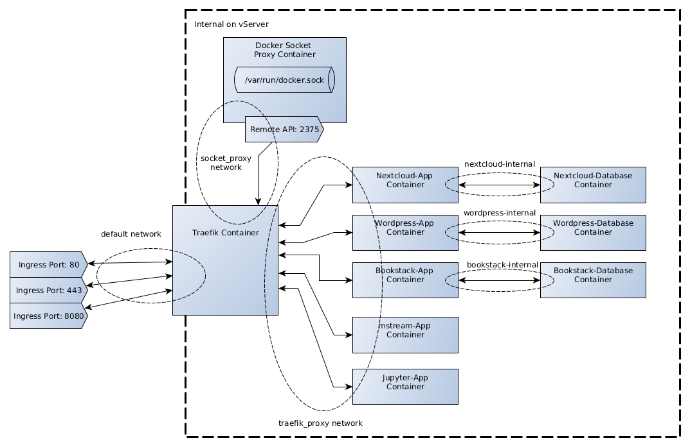

# vServer Docker Service Tutorial

This is the repository for my article on medium.com for setting up various services like:

* Nextcloud
* Wordpress
* Bookstack
* mstream
* Jupyter Lab
* Grav

With docker-compose, behind a Traefik v1.7 reverse proxy on a netcup GmbH vServer plattform. You can read the complete guide at: https://medium.com/@trn84

